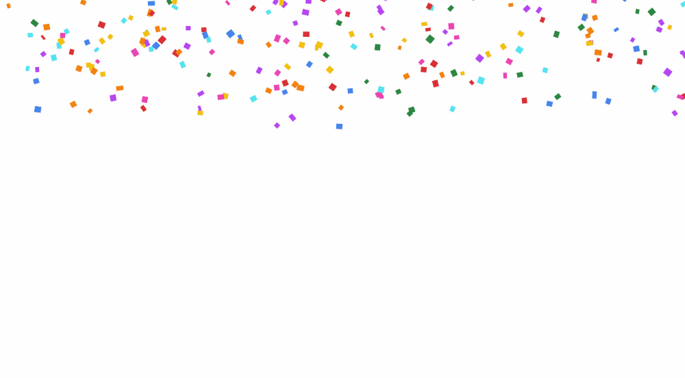

### 🎉 HAPPY NEW YEAR \!

 
 

해 바뀐지가 엊그제 같은데 벌써 3일이네요. ~~(엊그제 맞음)~~

구글도 새해를 기념하는 애니메이션을 '새해' 관련 검색 결과 페이지에 추가했는데요. 아래 영상.

 
 

👇 오늘은 요걸 그대로 따라 만들어 봤습니다. *\#HTML* *\#canvas*

어때요, 좀 비슷한가요?

큰 화면에서 다른점을 찾으려면 [여기](https://dircosine.github.io/google-new-year), 소스코드는 [여기](https://github.com/dircosine/google-new-year) 링크로 !

 
 

---
소스코드도 간단하고 html canvas 기본을 맛보기에 좋을 것 같아서,,,
 코드를 토막토막 소개하고 싶은데.
오늘은 귀찮아서 패스..!
