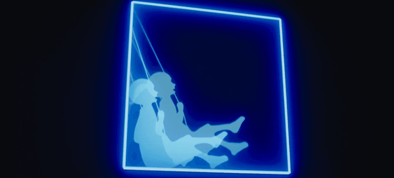
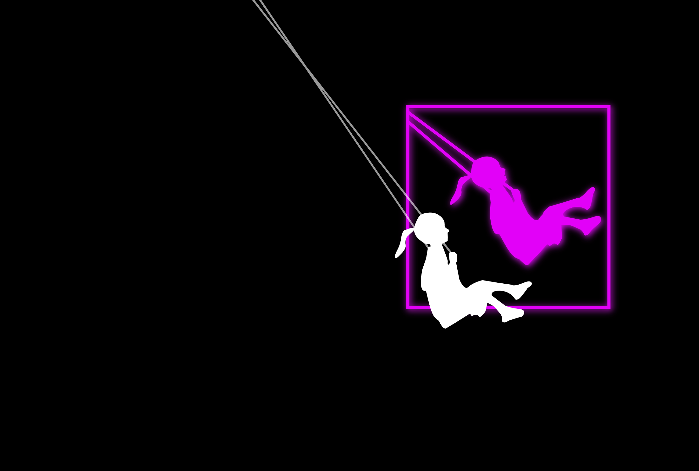

*캡처 영상 출처: [해별이님 블로그](https://blog.naver.com/PostView.nhn?blogId=shj0504&logNo=222126307679)*

 
 

얼마전에 종영한 드라마 *<스타트업>* 보셨나요?

위에 영상처럼,  
드라마속 '샌드박스'라는 스타트업 보육기관 곳곳에는 그네 타는 소녀의 역동적인 모습이 네온으로 장식돼 있는데요.

드라마 보는 내, 요게 은근히 눈을 사로잡아서 HTML canvas 로 만들어봤어요.

 
 

canvas 로 만들어진 샌드박스 그네타는 소녀의 캡처예요.

[이 링크](https://dircosine.github.io/sandbox-swing-girl/)에서 직접 플레이? 해 볼 수 있습니다.
 
소스코드는 [여기](https://github.com/dircosine/sandbox-swing-girl)

 
 
 

---

간단한 프로젝트지만, 코드 베이스는 [Interactive Developer 유튜브](https://www.youtube.com/user/cmiscm) 영상을 보면서 만들었습니다. 채널에 좋은 영상들도 많고 배울게 많아요 👍
